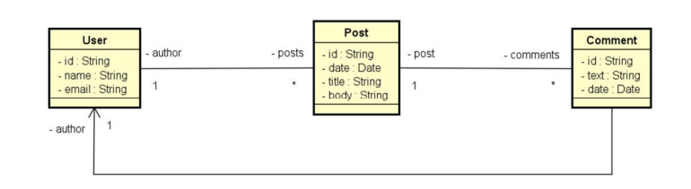

# SpringMongo Blog Engine

This project is developed using Spring Boot and MongoDB. It implements a Post object that allows users to create new posts and add comments.

## Table of Contents
- [Description](#description)
- [Technologies Used](#technologies-used)
- [Endpoints](#endpoints)
- [Getting Started](#getting-started)
- [Contributing](#contributing)
- [License](#license)

## Description
This project is built using Spring Boot and MongoDB and aims to provide a platform where users can create posts and add comments. The main entity in the project is the Post object, which represents a post made by a user. Each post can have multiple comments associated with it.

The project implements all the basic CRUD (Create, Read, Update, Delete) operations for managing users, posts, and comments. Users can register, create new posts, add comments to existing posts, and perform other essential actions.

## Technologies Used
- JDK 15
- Spring Boot
- Maven
- Postman
- MongoDB Community Server
- MongoDB Compass

## Endpoints
The application exposes the following endpoints:

| Endpoint          | Description                                 |
| ----------------- | ------------------------------------------- |
| `/users`          | Get all users                               |
| `/users/{id}`     | Get a specific user by ID                   |
| `/users/`         | Create a new user                           |
| `/users/{id}`     | Delete a user by ID                         |
| `/users/{id}`     | Update a user by ID                         |
| `/users/{id}/posts` | Get all posts by a specific user           |
| `/posts`          | Get all posts                                |
| `/posts/{id}`     | Get a specific post by ID                    |
| `/posts/titlesearch` | Search posts by title                     |
| `/posts/fullsearch` | Search posts by full text                  |
| `/posts`          | Create a new post                            |
| `/posts/{id}`     | Delete a post by ID                          |
| `/posts/{id}`     | Update a post by ID                          |

## Getting Started
To get started with the project, follow these steps:
1. Clone the repository.
2. Install JDK 15 and set up the environment.
3. Install and configure MongoDB Community Server and MongoDB Compass.
4. Build the project using Maven.
5. Run the application using Spring Boot.
6. Use Postman or any API testing tool to interact with the exposed endpoints.

## Contributing
Contributions are welcome! If you'd like to contribute to this project, please follow these guidelines:
1. Fork the repository.
2. Create a new branch for your feature or bug fix.
3. Commit your changes and push them to your branch.
4. Submit a pull request, explaining your changes in detail.

## License
This project is licensed under the MIT License.
